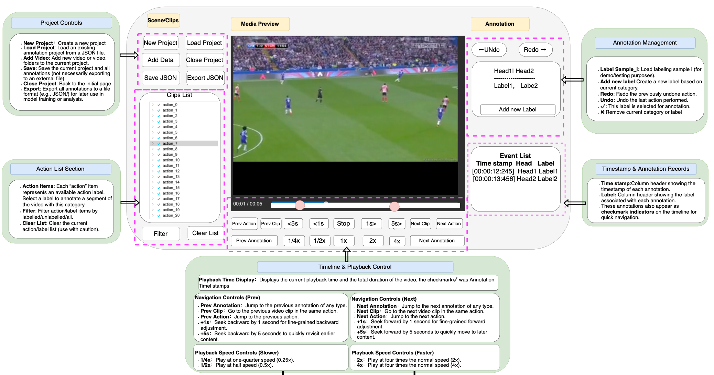

# Schema (Football Captioning / Action Description)

This folder contains **schema drafts and visual references** for annotating football video datasets, including:
- **Localization** (time/segment grounding notes)
- **Action Description** (single caption per clip)
- **Dense Action Description** (multiple time-aligned captions per long clip)

These PNGs are meant to serve as a **shared reference** when designing dataset JSON formats and building annotation tools/UI.

---

## Contents

- `Action Description.png`  
  Visual draft of the **Action Description** schema (one video clip → one or more captions, possibly multilingual).

- `Dense Action Description.png`  
  Visual draft of the **Dense Action Description** schema (one long video → multiple segments with `[start_ms, end_ms)` + caption).

- `localization.png`  
  Scratch notes related to **localization** (temporal grounding / segment alignment concepts).

---

## Quick Preview

### Action Description

### Dense Action Description

### Localization

---

## How to Use

1. **Dataset design**
   - Use the diagrams to align on required fields (e.g., `id`, `inputs`, `captions`, `dense_captions`, timestamps).
   - Keep paths consistent and decide whether your system stores raw videos, extracted features, or both.

2. **Annotation tool / UI**
   - For **Action Description**, design the UI around a single clip and a caption editor (with language tabs if multilingual).
   - For **Dense Action Description**, design the UI around a timeline with segment creation/editing and per-segment caption fields.

3. **Export & validation**
   - Ensure your final exports are **valid JSON** (note: standard JSON does **not** support comments like `//`).
   - Validate:
     - required keys present
     - timestamps are within video duration
     - `start_ms < end_ms`
     - optional: segment overlap rules (allowed vs forbidden)

---

## Notes / Conventions (Recommended)

- **Time format:** milliseconds (`ms`) relative to the start of the video file.
- **Segments:** use half-open intervals `[start_ms, end_ms)` to avoid boundary ambiguity.
- **Language field:** use short language tags like `en`, `fr`, etc.
- **Inputs:** you may include additional modalities (audio features, I3D, gamestate) as separate entries under `inputs`.

---
