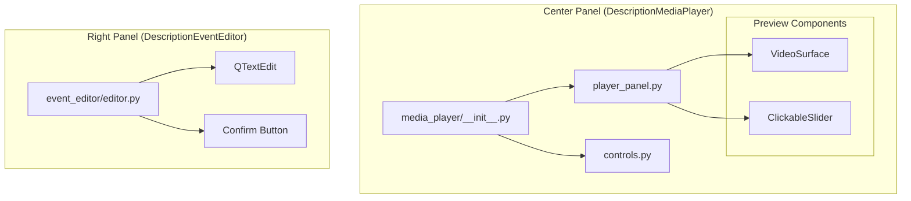

# 📝 UI: Description Mode

This directory contains the user interface components specifically designed for the **Description (Global Captioning)** mode.

In this mode, the focus is on providing a holistic text description for video content. The interface is divided into a **Composite Media Player** (Center) and a **Text Event Editor** (Right).

## 📂 Directory Structure

```text
ui/description/
├── event_editor/
│   ├── __init__.py           
│   └── editor.py             # Right Panel: Text Input & Action Buttons
│
└── media_player/
    ├── __init__.py           # Center Panel: Composite Widget (Combines Preview + Controls)
    ├── player_panel.py       # Internal: Video Surface, Slider, & Time Label
    └── controls.py           # Internal: Navigation Toolbar (Play/Pause, Next/Prev)

```

---

## 🧩 Components

### 1. Media Player (Center Panel)

The Center Panel is a **Composite Widget** defined in `media_player/__init__.py`. It orchestrates the video display and the navigation controls into a single layout.

#### A. Main Wrapper (`media_player/__init__.py`)

* **Class:** `DescriptionMediaPlayer`
* **Purpose:** Acts as the main container for the center of the screen.
* **Layout:** A `QVBoxLayout` that stacks:
1. `DescriptionMediaPreview` (The Video & Slider) - *Stretches to fill space*.
2. `DescriptionNavToolbar` (The Buttons) - *Fixed height at bottom*.


* **API:** It exposes crucial UI elements (`player`, `play_btn`, `next_clip`, etc.) so the Controller can easily connect signals without digging into child widgets.

#### B. Visual Preview (`media_player/player_panel.py`)

* **Class:** `DescriptionMediaPreview`
* **Purpose:** Renders the video and handles timeline interaction.
* **Key Features:**
* **Shared Surface:** Uses the common `VideoSurface` for consistent rendering.
* **Infinite Loop:** Sets `QMediaPlayer.Loops.Infinite` to allow repeated viewing while typing.
* **Clickable Slider:** A custom `QSlider` allowing absolute positioning on click.
* **Time Label:** Displays current position vs. total duration.


#### C. Navigation Toolbar (`media_player/controls.py`)

* **Class:** `DescriptionNavToolbar`
* **Purpose:** Provides playback and navigation controls.
* **Buttons:**
* **Action Navigation:** `<< Prev Action` / `Next Action >>` (Navigates logical events).
* **Clip Navigation:** `< Prev Clip` / `Next Clip >` (Navigates physical video files).
* **Playback:** `Play / Pause` toggle.


---

### 2. Event Editor (Right Panel)

Located in `event_editor/editor.py`.

* **Class:** `DescriptionEventEditor`
* **Purpose:** The input interface for the captioning task.
* **Components:**
* **Text Area:** A `QTextEdit` for multi-line description entry.
* **History:** `Undo` and `Redo` buttons (linked to the generic history manager).
* **Actions:**
* **Clear:** Resets the text field.
* **Confirm:** Submits the text as the description for the current clip.


---

## 🎨 Component Composition

The Description UI is assembled hierarchically:


