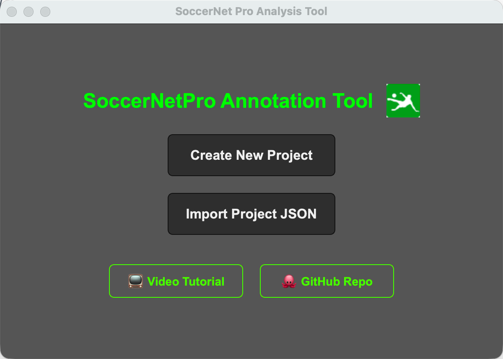
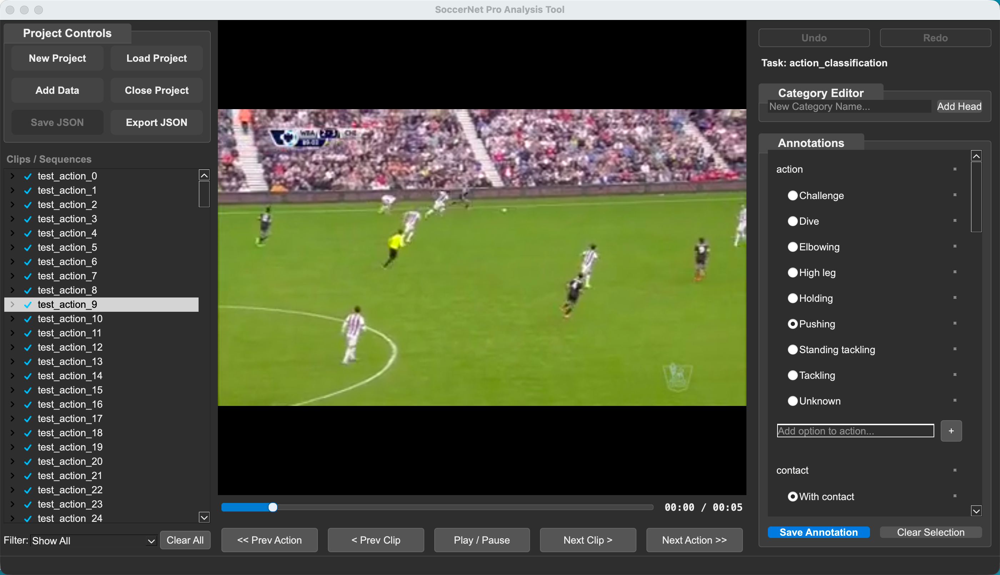
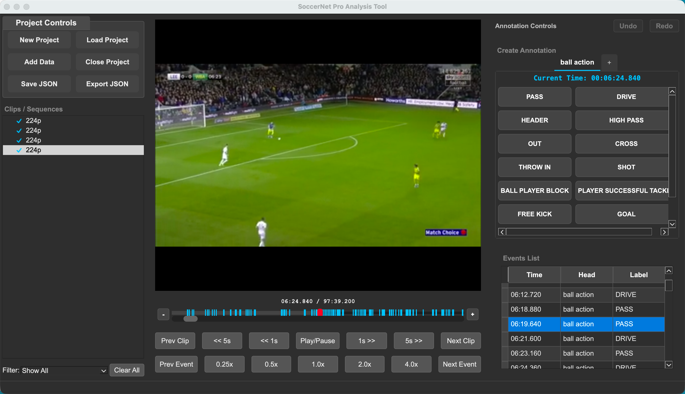
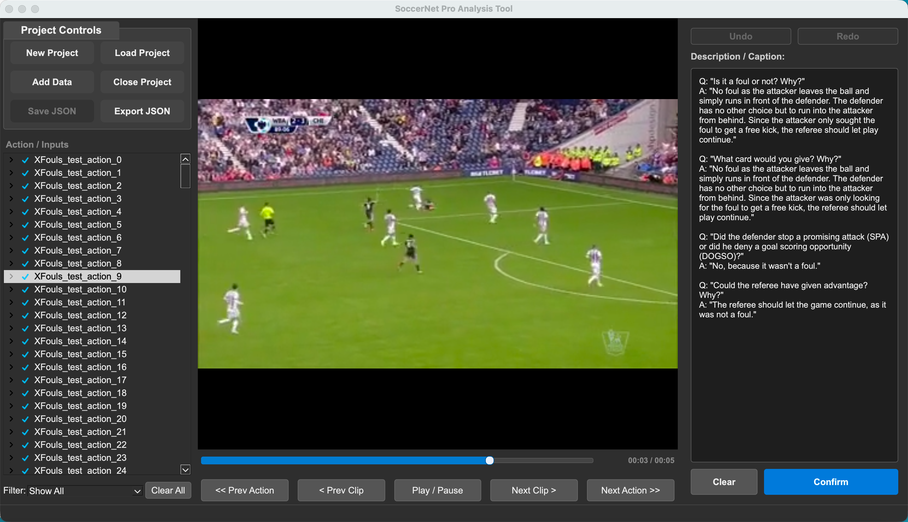
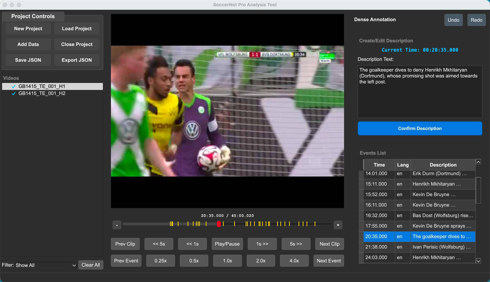

# GUI Overview

The OSL Annotation Tool supports two distinct annotation modes: **Classification** and **Localization (Action Spotting)**. The interface adapts based on the project type selected at startup.

---
# 1. Welcome Page (Startup Interface)

The Welcome Page is the entry point of the OSL Annotation Tool. It allows users to create or import projects and access additional resources.



### Main Actions

* **Create New Project**

  * Start a new annotation project.
  * You will be prompted to select the annotation mode (Classification, Localization, Description, or Dense Description).
  * Initializes an empty workspace.

* **Import Project JSON**

  * Load an existing annotation project from a JSON file.
  * The interface automatically adapts to the project type.
  * If the JSON contains validation errors, a detailed error message will be displayed.

### Additional Resources

* **Video Tutorial**

  * Opens a guided tutorial explaining how to use the tool.
  * Recommended for first-time users.

* **GitHub Repo**

  * Redirects to the official GitHub repository.
  * Includes documentation, updates, and issue tracking.

---

## 2. Classification Mode

Designed for assigning global labels (Single or Multi-label) to video clips.



### Left Panel: Clip Management
- **Scene/Clip List:** Displays the list of imported video files.
  - **Status Icons:** A checkmark (✓) indicates the clip has been annotated.
- **Add Data:** Import new video files into the current project.
- **Clear:** Clears the current workspace.
- **Project Controls:** New Project, Load Project, Add Data, Save JSON, Export JSON.


### Center Panel: Video Player
- **Video Display:** Main playback area for the selected clip.
- **Playback Controls:**
  - Standard Play/Pause.
  - Frame stepping and seeking (1s, 5s).
  - Playback speed control (0.25x to 4.0x).

### Right Panel: Labeling
- **Task Info:** Displays the current task name.
- **Label Groups:**
  - **Single Label:** Radio buttons for mutually exclusive categories (e.g., Weather).
  - **Multi Label:** Checkboxes for non-exclusive attributes (e.g., Objects present).
  - **Dynamic Editing:** Users can add new label options on the fly using the input field within each group.
- **Controls:**
  - **Confirm Annotation:** Saves the current selection to the clip.
  - **Undo/Redo:** Controls to undo or redo annotation actions.
  - **Clear Selection:** Resets the current selection.
  - **Save/Export:** Options to save the project JSON.

---

## 3. Localization Mode (Action Spotting)

Designed for marking specific timestamps (spotting) with event labels.



### Left Panel: Sequence Management
- **Clip List:** Hierarchical view of video sequences.
- **Project Controls:** New Project, Load Project, Add Data, Save JSON, Export JSON.
- **Filter:** Filter the list to show "All", "Labelled Only", or "Unlabelled Only".
- **Clear All:** Resets the entire workspace.

### Center Panel: Timeline & Player
- **Media Preview:** Video player with precise seeking.
- **Timeline:** Visual representation of the video duration.
  - **Markers:** Blue ticks indicate spotted events on the timeline.
- **Playback Controls:** Includes standard transport controls and variable speed playback.

### Right Panel: Annotation & Spotting
This panel is divided into a header, a spotting area, and an event list.

#### **Header**
- **Undo/Redo:** Dedicated buttons to undo or redo spotting actions and schema changes.

#### **Top: Spotting Controls (Tabs)**
- **Multi-Head Tabs:** Organize labels by categories (Heads) such as "Action", "Card", "Goal".
- **Label Grid:** Click any label button to instantly **spot an event** at the current playhead time.
- **Context Menu:** Right-click a label button to **Rename** or **Delete** it.
- **Add New Label:** - Click **"+ Add new label at current time"** to pause the video, define a new label name, and automatically spot it at the paused timestamp. The video resumes automatically after confirmation.

#### **Bottom: Event List (Table)**
- **Table Columns:**
  - **Time:** The timestamp of the event.
  - **Head:** The category of the event.
  - **Label:** The specific label name.
- **Interaction:**
  - **Double-click:** Jumps the video player to the event's timestamp.
  - **Right-click:** Opens a context menu to **Edit Time**, **Change Head/Label**, or **Delete Event**.
 
---

# 4. Description Mode (Clip-level Description / Captioning)

Designed for assigning structured textual descriptions to short video clips, including question–answer style annotations.



### Left Panel: Action / Clip Management

* **Action List:** Displays imported action clips (e.g., XFouls_test_action_*).

  * A checkmark (✓) indicates the clip has been annotated.
* **Project Controls:** New Project, Load Project, Add Data, Save JSON, Export JSON.
* **Filter:** Filter by annotation status.
* **Clear All:** Clears the current workspace.

---

### Center Panel: Video Player

* **Video Display:** Main playback area for the selected action clip.
* **Timeline Slider:** Shows clip progress.
* **Playback Controls:**

  * Play / Pause
  * Navigate between actions or clips
  * Fine seeking
* **Time Indicator:** Displays current time and total clip duration.

---

### Right Panel: Description / Caption Annotation

This panel is dedicated to structured textual annotation.

#### Description / Caption Text Area

* Large editable text field.
* Supports multi-line structured annotations.
* Typical format includes:

  * Question–Answer (Q/A)
  * Event reasoning explanations
  * Referee decision analysis

Example structure:

```
Q: "Is it a foul or not? Why?"
A: "..."
```

#### Controls

* **Confirm**

  * Saves the description to the current clip.
* **Clear**

  * Clears the text field without saving.
* **Undo / Redo**

  * Reverts recent text changes.
---

# 5. Dense Description Mode (Event-level Captioning)

Designed for fine-grained event-level captioning across full-length videos.



This mode combines timestamped events with free-text descriptions.

---

## Left Panel: Video Management

* **Video List:** Displays imported video halves (e.g., GB1415_TE_001_H1, H2).

  * ✓ indicates that the video contains at least one annotated event.
* **Project Controls:** New Project, Load Project, Add Data, Save JSON, Export JSON.
* **Filter:** Filter videos by annotation state.
* **Clear All:** Resets workspace.

---

## Center Panel: Timeline & Player

* **Media Preview:** Main video playback window.
* **Timeline:**

  * Visual representation of the full video duration.
  * **Markers:**

    * Yellow ticks represent annotated events.
    * Red indicator represents the current playhead position.
* **Current Time Display:** Shown above the description input.
* **Playback Controls:**

  * Frame stepping
  * 1s / 5s seeking
  * Speed control (0.25x–4.0x)
  * Previous/Next event navigation

---

## Right Panel: Dense Annotation

Divided into two functional areas.

---

### Top: Create / Edit Description

* **Current Time Indicator**

  * Displays the precise timestamp of the playhead.
* **Description Text Box**

  * Enter detailed natural-language descriptions of events.
  * Designed for dense commentary-style annotation.
* **Confirm Description**

  * Saves a new event at the current timestamp.
  * Adds a marker to the timeline.
  * Appends the event to the event table.

---

### Bottom: Events List (Table)

Displays all annotated events in chronological order.

#### Columns:

* **Time** – Timestamp of the event.
* **Lang** – Language tag (e.g., "en").
* **Description** – The textual annotation.

#### Interaction:

* **Single-click** – Select event.
* **Double-click** – Jump to event timestamp.
* **Editing** – Modify description text and confirm to update.
* **Delete** – Remove event from table and timeline.

---
