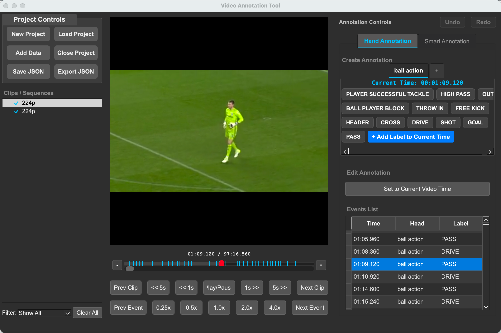

# Soccernet Pro Tool

Welcome to the Soccernet Pro Annotation Tool documentation!

This tool helps you annotate action spotting datasets in sports video. Use the navigation to find installation instructions, user guides, and more.

**Features:**
  - Intuitive graphical interface for annotating actions in sports videos
  - Fast video navigation and frame-accurate annotation
  - Easily edit timestamps and action labels
  - Supports OSL JSON annotation format for seamless integration with [OSL-ActionSpotting](https://github.com/OpenSportsLab/OSL-ActionSpotting)
  - Save and load annotation files
  - Keyboard shortcuts for power users
  

---
[Get started &rarr;](getting_started.md)

---

## Why use it?

- Quickly create high-quality, consistent annotations for action spotting tasks
- Designed for researchers, annotators, and data scientists working on sports video understanding

---

## Quick links

- [Installation](installation.md)
- [User Guide](gui_overview.md)
- [FAQ](faq.md)

---

## License

This project is licensed under the GNU General Public License v3.0 (GPL-3.0).
See [GitHub repository](https://github.com/OpenSportsLab/soccernetpro-ui) for details.
